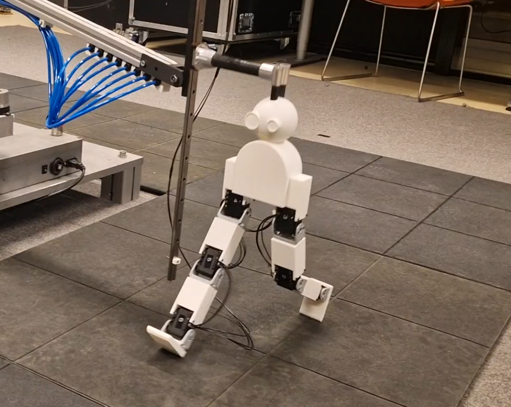

# Lil Runner

*A project in the course IN5590 By Lazo Omar*


## 1) Firmware/software for the robot/prototype


Setup instructions:
```
$ pip install -r requirements.txt
$ cd in5590_assignment6/src
```

Run instructions: 
```
$ python lil_runner.py
```


## 2) Images from testing the robot


[](./poster/main.pdf)

[](./poster/main.pdf)


Read more on my poster about the robot [here](./poster/main.pdf). For information on
CAD files, go to [this repo](https://github.uio.no/lazoo/in5590_assignment5).


